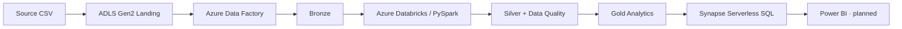

# Azure Retail Data Platform

A Senior Data Engineering portfolio project built on the Olist retail dataset.
The platform ingests source CSVs, produces quality-checked analytics in a
Medallion lake, and serves Gold Parquet through SQL without duplicating data.

**Deployed and executed on Azure:** ingestion, Silver processing, Gold analytics
and Synapse Serverless queries have been validated with real data. Power BI is
the planned visualization layer; a completed dashboard is not yet available.

## Architecture



Bronze preserves source data, Silver applies typed schemas, normalization and
quality checks, and Gold aggregates business metrics. ADF handles ingestion;
Databricks handles transformations. Synapse exposes the existing Gold Parquet
as SQL views, ready for Power BI consumption.

**Technologies:** Azure Data Lake Storage Gen2 · Azure Data Factory · Azure
Databricks · PySpark · Unity Catalog · Synapse Serverless SQL · Terraform ·
Power BI (planned).

## Validated results

Silver data quality and persisted-data validation passed, including five
referential checks. A second execution with the same approved inputs returned
`no-op`, preserving the published build and demonstrating idempotency.

| Silver table | Rows |
|---|---:|
| customers | 99,441 |
| orders | 99,441 |
| order_items | 112,650 |
| order_payments | 103,886 |
| products | 32,951 |
| sellers | 3,095 |

| Gold dataset / Synapse view | Rows |
|---|---:|
| sales_by_state / dbo.vw_sales_by_state | 27 |
| sales_by_category / dbo.vw_sales_by_category | 74 |
| sales_by_payment_type / dbo.vw_sales_by_payment_type | 5 |
| top_sellers / dbo.vw_top_sellers | 3,095 |
| top_customers / dbo.vw_top_customers | 96,135 |

All five Gold datasets passed validation and sales reconciliation. All five
Synapse views were queried successfully: SQL counts match Gold, and five
analytical queries verified states, categories, payment distribution, sellers
and customers. Product revenue and payment value remain distinct measures.

Synapse serves database `retail_analytics` in workspace
`syn-retail-data-dev-c569ffc1` (`centralus`). Clients authenticate with Microsoft
Entra; the workspace Managed Identity has read-only access to Gold.

## Repository structure

```text
infra/                 Terraform for Azure and Unity Catalog
src/retail_data_core/  Portable PySpark transformations and quality rules
integration/          Databricks adapters and task entry scripts
resources/            Databricks Job definitions
serving/synapse/      SQL views, validation and analytical queries
scripts/              Build, test and SQL serving runners
tooling/              Source snapshot and Bronze verification contracts
tests/                Core tests
integration_tests/    Adapter and Spark integration tests
packaging_tests/      Wheel contract tests
databricks.yml        Databricks Asset Bundle
```

## Interview talking points

- **ADF / Databricks responsibilities:** ingestion orchestration versus PySpark processing.
- **Idempotency:** deterministic Silver build identity, immutable publication and verified `no-op` reuse.
- **Medallion architecture:** traceable progression from source data to analytical datasets.
- **Data Quality:** schema, grain, required values, referential integrity and reconciliation checks.
- **Unity Catalog / Managed Identity:** governed external volumes and scoped storage access without embedded credentials.
- **Serverless SQL serving:** typed views over Gold Parquet, queried directly and prepared for visualization.

Further details: [Databricks processing](integration/databricks/README.md) ·
[Synapse serving](serving/synapse/README.md).
