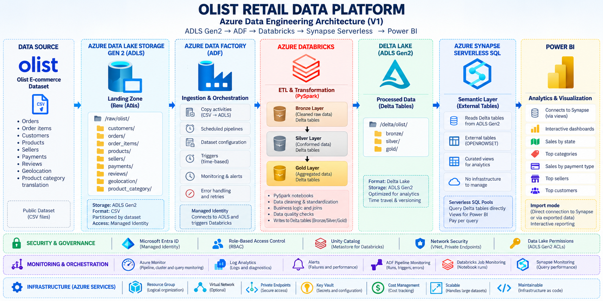
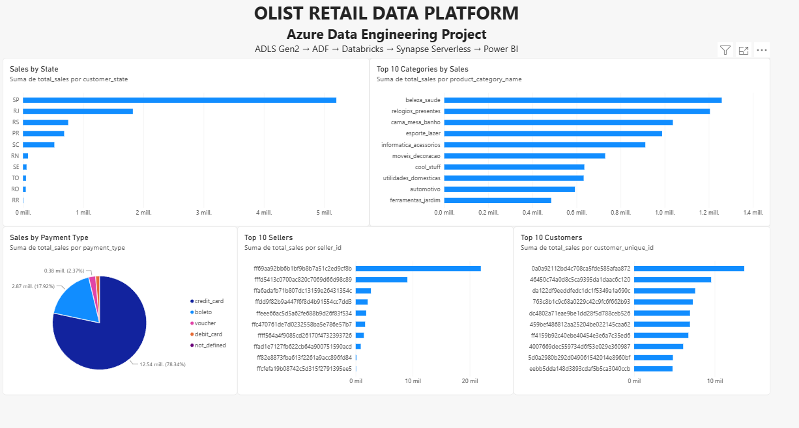

# Azure Retail Data Platform

An end-to-end Azure Data Engineering portfolio using the public Olist retail
dataset: preserve source files, publish quality-checked analytics, and expose
business results through SQL and Power BI. Ingestion, Silver, Gold and Synapse
queries were executed on Azure; the final dashboard imports their SQL extracts.

## Architecture and data flow



**Implemented flow:** Olist CSV → ADLS Gen2 Landing → Azure Data Factory →
Bronze → Azure Databricks / PySpark → Silver + Data Quality → Gold analytics
→ Azure Synapse Serverless SQL → CSV extracts → Power BI Import.

The supplied image is a conceptual overview, not a deployment inventory. The
implemented lake uses original CSV in Bronze and **Parquet**, not Delta tables,
in Silver/Gold. Synapse uses views over `OPENROWSET`, not external SQL tables.
Scheduled triggers, ADF-to-Databricks triggering, Key Vault, private endpoints,
custom alerts and Log Analytics shown in the illustration are not implemented.

- **ADF** copies manifest-listed files from Landing into isolated Bronze attempts.
  Verification compares inventory, byte sizes and SHA-256 against Landing before
  publishing Audit completion evidence; ADF success alone does not certify data.
- **Databricks Jobs** run the portable PySpark core: six typed, normalized Silver
  tables, then five Gold analytical datasets. Bronze preserves the original files.
- **Data Quality** gates publication on schemas, required values, unique grains,
  nonnegative metrics, five referential/orphan checks and persisted-data validation.
- **Unity Catalog** governs external volumes. Managed Identity and container-scoped
  Azure RBAC provide storage access; the development operator also owns UC objects,
  so this project does not claim a tested production least-privilege boundary.
- **Synapse Serverless** exposes existing Gold Parquet through five typed views in
  `retail_analytics`. Its Managed Identity has read-only Gold access; SQL clients
  use Microsoft Entra authentication. No serving copy of Gold is created in Azure.

## Evidence of real execution

These are completed execution results, not a fresh cloud health check:

| Stage | Validated result |
| --- | --- |
| ADF / Bronze | Successful run `d743944b-2065-4dfb-b911-eb7cb2fb084a`; nine source CSVs verified against Landing before Audit COMPLETE |
| Silver | Databricks run `398855049611878`: SUCCESS; six tables published; DQ PASSED, five relationship checks with zero orphans |
| Silver reuse | Run `1118167324398464`: SUCCESS; revalidation returned `no-op`, preserving the published build |
| Gold | Run `336824124776750`: SUCCESS; five persisted Parquet datasets passed validation and sales reconciliation |
| Synapse | Deployed Serverless SQL; all five views queried successfully, with counts matching Gold |
| Power BI | Completed dashboard using five UTF-8 CSV extracts queried from those views |

Silver counts: customers **99,441**, orders **99,441**, order_items **112,650**,
order_payments **103,886**, products **32,951**, sellers **3,095**.

| Gold dataset / Synapse view suffix | SQL and CSV rows |
| --- | ---: |
| sales_by_state | 27 |
| sales_by_category | 74 |
| sales_by_payment_type | 5 |
| top_sellers | 3,095 |
| top_customers | 96,135 |

Each view is named `dbo.vw_<dataset>`. Execution contracts and supporting details:
[Databricks](integration/databricks/README.md) · [Synapse](serving/synapse/README.md).
Raw operational evidence remains in ignored local `.tools/`; it is not published.

## Power BI dashboard



[Final PBIX](powerbi/azure-retail-dashboard.pbix) · [CSV inputs](powerbi/data/)

The report shows Sales by State, Top 10 Categories by Sales, Sales by Payment
Type, Top 10 Sellers and Top 10 Customers. The underlying seller/customer
extracts contain all grouped records; the visuals select the top ten.

**This PBIX uses Import from CSV, not a direct/live Synapse connection.** Synapse
was deployed and its views validated, but authentication restrictions of the
available Power BI account required exporting the views. The target architecture
supports direct consumption of Synapse SQL with an appropriate corporate/Entra
identity, permissions, configuration and licensing; that path was not used here.
The committed extracts are static public Olist results, not an automatic refresh.

## Stack and repository

ADLS Gen2 · Azure Data Factory · Azure Databricks / PySpark · Unity Catalog ·
Azure Synapse Serverless SQL · Microsoft Entra / Managed Identity / Azure RBAC ·
Terraform · Databricks Asset Bundles / Jobs · Parquet · Power BI.

```text
infra/                 Terraform roots for Azure and Unity Catalog
src/retail_data_core/  Portable transformations and quality rules
integration/          Databricks adapters and task entry scripts
resources/            Databricks Job definitions
serving/synapse/      SQL views, validation and analytical queries
scripts/              Build, test, SQL serving and CSV export runners
tooling/              Landing snapshots and Bronze integrity verification
powerbi/              Final PBIX and five CSV inputs
docs/images/          Architecture overview and dashboard screenshot
tests/                Core tests
integration_tests/    Adapter and Spark integration tests
packaging_tests/      Wheel contract tests
databricks.yml        Databricks Asset Bundle
```

## Reproducing the project

- **Local:** open the PBIX in Power BI Desktop to inspect the imported report.
  To refresh from the included CSVs, update its local source paths to your checkout.
  Core tests use the pinned Spark Docker image via `scripts/run_tests.ps1`;
  [packaging](PACKAGING.md) and [adapter documentation](integration/databricks/README.md)
  describe the remaining build/test steps. Docker is required for Spark tests.
- **Azure:** infrastructure provisioning requires your subscription, existing
  identity, scoped permissions and private runtime inputs. Follow the separate
  [Azure Terraform](infra/terraform/README.md) and [Unity Catalog](infra/unity-catalog/README.md)
  roots, then the Bundle/Jobs and Synapse documentation. Environment-specific
  names, identities and approved snapshot/build parameters must be adapted;
  provisioning and execution incur Azure costs.
- **Export only:** with the existing Synapse views and an authenticated Azure CLI
  session, the reusable runner performs only SELECT queries and checks expected
  counts. Use an empty output directory; it refuses to overwrite existing CSVs:

  ```powershell
  powershell -NoProfile -ExecutionPolicy Bypass -File scripts/export_powerbi.ps1 `
    -Server <workspace>-ondemand.sql.azuresynapse.net -OutputDirectory <empty-directory>
  ```

## Design decisions

Medallion layers separate byte-preserving ingestion, validated tables and business
aggregates. Silver uses deterministic build identities and completion markers
for idempotent publication; this is not storage WORM. Gold remains Parquet and
Synapse reads it without another cloud data copy. Product-price revenue and
payment value are distinct measures; distinct order counts are not additive
across categories, sellers or payment types. Tokens remain in memory; local
credentials, Terraform state/plans and operational artifacts stay outside Git.
